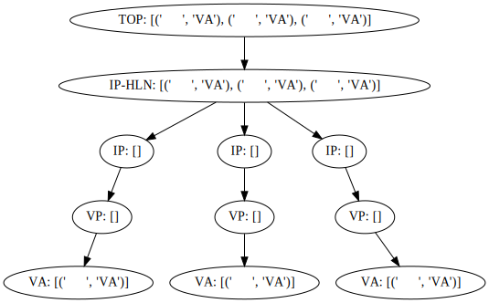
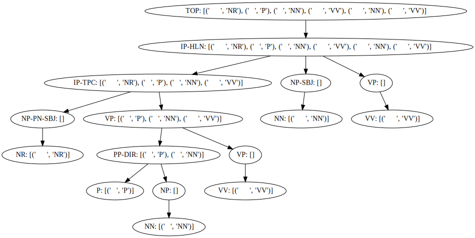

# Constituency Tree Labeling Tool

> The purpose of this package is to solve the `constituency tree labeling` problem.

Look from the dataset labeled by NLTK,it is a bit counter-intuitive and it is very troublesome to label.

Then this package provides a `LabelTree`, you can use this class to generate dataset, for example, `convert example1` and `convert example2`, and then use the `label_tree_to_nltk` method to convert them into data conforming to the NLTK label format. 

## Install

```bash
pip install constituency-tree-labeling-tool
```

## examples

### example1

> NLTK example 1
```
     TOP      
      |        
    IP-HLN    
  ____|_____   
 IP   IP    IP
 |    |     |  
 VP   VP    VP
 |    |     |  
 VA   VA    VA
 |    |     |  
 清新   清新    清新
```

> convert example 1



### example2
> NLTK example 2
```
                      TOP                 
                       |                   
                     IP-HLN               
                 ______|________________   
              IP-TPC              |     | 
     ___________|______           |     |  
    |                  VP         |     | 
    |            ______|_____     |     |  
    |         PP-DIR         |    |     | 
    |       ____|______      |    |     |  
NP-PN-SBJ  |           NP    VP NP-SBJ  VP
    |      |           |     |    |     |  
    NR     P           NN    VV   NN    VV
    |      |           |     |    |     |  
    广西     对           外     开放   成绩    斐然
```
> convert example 2


### example3

```
                        TOP                    
                         |                      
                        陈述句                    
    _____________________|____                  
   |         |                客体               
   |         |            ____|________         
   |         主体         转折句1          转折句2     
   |      ___|___     ___|____      ___|____    
  rph   org      v   t   n    c    t   t    n  
   |     |       |   |   |    |    |   |    |   
据中央时报报道  华为      说   虽然  今年  举步维艰  但是  未来  一片光明
```

To sequence:

```
[(0, 9, '陈述句'), (0, 3, '陈述句|<>'), (0, 1, '陈述句|<>'), (1, 3, '主体'), (1, 2, '主体|<>'), (2, 3, '主体|<>'), (3, 9, '客体'), (3, 6, '转折句1'), (3, 5, '转折句1|<>'), (3, 4, '转折句1|<>'), (4, 5, '转折句1|<>'), (5, 6, '转折句1|<>'), (6, 9, '转折句2'), (6, 8, '转折句2|<>'), (6, 7, '转折句2|<>'), (7, 8, '转折句2|<>'), (8, 9, '转折句2|<>')]

```


##  More Usage: 

1. [convert NLTK tree to LabelTree](./constituency_labeling/tests/test_convert.py)
2. [use LabelTree or web frontend use](./constituency_labeling/tests/test_label_tree.py)
3. [convert NLTK tree to sequence](./constituency_labeling/tests/test_transform.py)

# 成分分析树标注工具

> 这个包的目的在于标注成分分析树。

从NLTK标注出来的数据集来看，有点反直觉，标注起来很麻烦。
那么此包提供一个`LabelTree`，您可以通过这个类来生成例如`convert example1`以及`convert example2`，然后通过`label_tree_to_nltk`方法将其转换成符合nltk标注格式的数据出来。